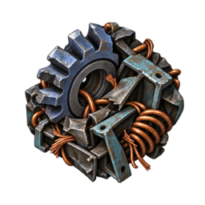

# Yuoki Industries: Quinityn

  
  

<strong>A forgotten contract world. An ocean of unicomp. An industry waiting to restart.</strong>

  <strong>Factorio 2.1 + Space Age · Yuoki Industries + Engines · Playable preview</strong>

Quinityn takes a world from YuokiTani's original stories and turns it into a
hostile industrial frontier. Pick through buried machinery, pump purple seas of
**Liquid Unicomp A2**, and rebuild a factory among weathered soil, dead turf,
ash, slag and poisoned trees. The native biters have already made themselves
at home.

This planet add-on gives **Yuoki Industries and Yuoki Industries Engines** a
destination and a progression of their own. Their recipes stay locked until you
physically land on Quinityn. Once you do, the climb from salvaged parts to advanced
industry begins.

Grey-purple rocks appear only on Quinityn, with 20 big and 16 huge sprite
variants replacing ordinary mineable rocks. Mining keeps normal stone/coal
drops and adds 2 or 4 flyash; the first rock reveals science. Each five-pack
batch needs **five flyash**. Collect 100 ash to research Power and **Fatmice air
scrubbing**, then automate collection. **Reusable air filters** improve capture
later; surplus ash can become rocket fuel. Other planets' rocks remain unchanged.

Initial enemy nests and worms generate on brown slag; later colonies can expand
onto other walkable terrain.

**[Get started](#get-started)** · **[Progression guide](https://github.com/jatmn/yuoki-quinityn/blob/main/docs/progression.md)** ·
**[Report a bug](https://github.com/jatmn/yuoki-quinityn/issues)** ·
**[Contribute](https://github.com/jatmn/yuoki-quinityn/blob/main/CONTRIBUTING.md)**

## Your next industrial outpost

| Discover | Build around it |
| --- | --- |
| **Purple unicomp seas** | Pump the shoreline for industry, or feed unwanted items into it with shore inserters using native lava disposal. |
| **A ruined landscape** | Explore weathered soil and dead turf between industrial scars, mixed ash-and-earth margins, clustered machinery stockpiles and coastal ruined districts. Sparse purple dead-tree groves have their own generation controls. |
| **An empty-inventory challenge** | Start with local N4 and F7 deposits, hand processing and salvage. Work toward water, power, science and a locally built rocket. |
| **A Yuoki technology journey** | Progress through materials, power, Cimota reconstruction, Mechanical Force, refining, farming, defense, trade and advanced industry. |
| **Reasons to return** | Manufacture Durotal foundations and feed infinite mining productivity and Yuoki plasma damage research. |

## Land. Salvage. Rebuild. Launch.

1. **Discover Quinityn and travel from Nauvis.** Discovery alone does not unlock
   its industry: a character must physically land to complete the field survey.
2. **Make the first machines count.** Crush and press local resources, recover
   salvage, and build a primitive burner Cimota to begin processing.
3. **Bring the factories online.** Mining a Quinityn rock reveals science;
   crafting milestones lead through the components and first factory needed to
   manufacture it. All three Yuoki factories can produce it; vanilla assemblers
   cannot.
4. **Turn an outpost into an industrial world.** Expand over unicomp with
   Durotal foundations, establish local rocket production, and export research
   data for continuing upgrades.

**61 in-game Tips and Tricks chapters** walk you through the stages. Arriving
with no items is supported after researching discovery; ordinary initial spawn
and platform travel remain unchanged. For the production details, open the
[local-resource and progression guide](https://github.com/jatmn/yuoki-quinityn/blob/main/docs/progression.md).

## Get started

> **Development preview — version 0.1.0.** The validated baseline is Factorio
> **2.1.21 with Space Age**, plus the pinned **Yuoki 1.3.0** and
> **Engines 1.3.0** development builds. Published 2.0 dependency versions cannot
> substitute for them. A full graphical playthrough and balance review remain
> outstanding.

Build the current source using the [installation and packaging guide](https://github.com/jatmn/yuoki-quinityn/blob/main/docs/development.md).
Install the Quinityn, Yuoki and Engines zip files in your Factorio mods directory
and enable them with Space Age.

An [earlier v0.1.0 development snapshot](https://github.com/jatmn/yuoki-quinityn/releases/tag/v0.1.0)
is also available to users with repository access. It predates the current
source and is not the initial public release. Its dependency builds are pinned to:

- [Yuoki 1.3.0 / Factorio 2.1 PR #11](https://github.com/jatmn/Yuoki-Factorio-2.0/pull/11),
  commit `ce7918f`.
- [Engines 1.3.0 / Factorio 2.1 PR #3](https://github.com/jatmn/Yuoki-Engines-Factorio-2.0/pull/3),
  commit `dd13f42`.

Keep a backup of development saves. **Use a fresh Quinityn surface or map to see
all terrain changes**: generated terrain is not rewritten, and existing
surfaces can retain saved generation settings. Read the
[save compatibility notes](https://github.com/jatmn/yuoki-quinityn/blob/main/docs/validation.md#limits-and-save-compatibility)
before updating an existing factory.

## Tested in the engine, still being shaped by play

The recorded headless-engine checks cover terrain across multiple seeds,
landing routes, recipe gates, actual unicomp pumping and disposal, burner water
production, factory science, research and rocket construction/launch. Separate
resource and finite-stock analyses check the empty-inventory bootstrap.

These checks do not replace a full graphical playthrough. Visual polish, tutorial
presentation, overall balance and compatibility with other overhaul mods still
need playtesting. See [validation and limitations](https://github.com/jatmn/yuoki-quinityn/blob/main/docs/validation.md) and the
[recorded results](https://github.com/jatmn/yuoki-quinityn/blob/main/docs/test-results.txt).

## Built on Yuoki's world

Quinityn's name and contract-world inspiration come from **YuokiTani**. The
unicomp oceans and this particular industrial landscape are this add-on's
adaptation, not claims about the original stories. Maintained by **jatmn**.

- [Historical research, lore and primary sources](https://github.com/jatmn/yuoki-quinityn/blob/main/docs/research.md)
- [Forum coverage index](https://github.com/jatmn/yuoki-quinityn/blob/main/docs/forum-index.json)
- [Engine-generated recipe unlock manifest](https://github.com/jatmn/yuoki-quinityn/blob/main/docs/recipe-unlocks.json)
- [Artwork origins and generation prompts](graphics/README.md)

Quinityn is licensed under **[CC BY-NC-SA 4.0](LICENSE)**, matching Yuoki
Industries. Credit the creators, keep adaptations under the same license, and
respect its noncommercial terms. Engines retains its MIT license; Factorio and
Space Age material remains subject to Wube's terms. See [NOTICE](NOTICE) for
attribution and the science icon's third-party artwork exception.

Bug reports, translations, playtest feedback and focused pull requests are
welcome. Read [CONTRIBUTING.md](https://github.com/jatmn/yuoki-quinityn/blob/main/CONTRIBUTING.md); coding agents should also read
[AGENTS.md](https://github.com/jatmn/yuoki-quinityn/blob/main/AGENTS.md). Only jatmn and designated maintainers merge into `main`.
