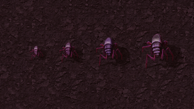
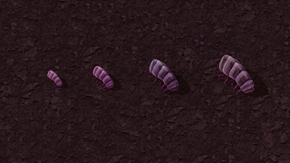
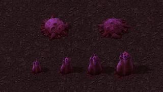
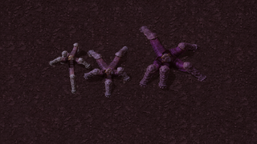

# Enemy field guide

[Documentation index](../README.md) · [Getting started](getting-started.md)

Quinityn's industry left more than wreckage. Its **Uni-touched** inhabitants
have adapted to the surrounding unicomp waters, and they respond to industrial
pollution. The current source adds these enemies; the historical 0.1.0 preview
does not contain them.

## Uni-touched colonies

| Inhabitant | What to expect |
| --- | --- |
| **Biters** | Familiar charging attackers, from small to behemoth, in distinct violet shades |
| **Spitters** | Ranged acid attacks, with the same four size tiers |
| **Worms** | Stationary defenders around colonies, also small through behemoth |
| **Biter and spitter nests** | Violet colonies that produce local variants and occasionally Stomp-a-trons |

These enemies take **5% less laser damage than their ordinary counterparts**.
That is a relative reduction in incoming damage, including for worms with
existing laser resistance; it is not a flat five-point increase to every
resistance value. Other native combat properties are retained.

Initial nests and worms generate on **brown slag**. Colonies can later expand
onto other walkable ground and keep their Uni-touched identity. The variants
generate only on Quinityn; other planets keep their native enemies. Normal
capture rockets can target Uni-touched nests.

Quinityn absorbs very little pollution, so expand defenses as industry grows.
Unicomp blocks walking biters and spitters, but the landing area connects to
the wider land through winding corridors. A coastline is not a guarantee that
your factory is isolated.

## Stomp-a-trons

Five organic legs carry a **Spidertron body with yellow sensors**. Small
Stomp-a-trons have pale blue-gray bodies and blue-violet flesh; medium ones
shift toward lavender, and big ones deepen toward royal purple. They stand
at **half the dimensions of the corresponding Gleba stomper** while retaining
the original stomper's health and damage. Their laser resistance is lower than
that of the original stomper. Small does not mean harmless.

| Size | Laser resistance | Industrial salvage | Additional loot |
| --- | --- | --- | --- |
| Small | 3% | 1–2 | 1–5 Ancient Data Fragments |
| Medium | 7% | 3–4 | 4–7 Ancient Data Fragments |
| Big | 11% | 6–9 | 1 Data Crystal |

Both local nest types can produce all three sizes. Each Stomp-a-tron has
**one tenth the spawn weight of the corresponding biter or spitter** on that
nest's evolution curve. This is a relative weight, not a flat 10% spawn chance.
Medium variants begin above 20% evolution in biter nests and 40% in spitter
nests; big variants begin above 50%.

Stomp-a-trons join pollution-driven attacks. They cannot establish Gleba
nests and leave **no wrigglers or pentapod eggs**. Their organic and mechanical
ancestry is [Quinityn add-on lore](../lore/quinityn.md#the-stomp-a-trons).

## Existing surfaces

Use a fresh Quinityn surface to see the current naturally generated population.
Existing enemies are preserved. Uni-touched nests on existing surfaces gain
Stomp-a-tron offspring; ordinary nests retained from older saves keep their
ordinary offspring. Changing the mod does not replace an established colony.

## Visuals and validation

These are **editor-staged in-game captures** on Quinityn, made with Factorio
2.1.21 + Space Age and the pinned dependencies. Click a thumbnail for the
1920 × 1080 original. Relative sizes are preserved within each shot.

| Uni-touched biters | Uni-touched spitters |
| :---: | :---: |
|  |  |
| Small, medium, big and behemoth, left to right. | Small, medium, big and behemoth, left to right. |

| Colony defenders | Stomp-a-trons |
| :---: | :---: |
|  |  |
| Biter nest left, spitter nest right; worms increase from small to behemoth below. | Small, medium and big, left to right. Open the full image to see the yellow sensors. There is no behemoth tier. |

The [capture record](../contributing/screenshots.md#capture-record) identifies
the source commit, versions, seeds, staging, camera settings and faithful
thumbnail processing. The landscape and earlier creature concepts remain
artistic references, separate from these screenshots.

Headless fixtures check spawning, laser damage, loot, colony construction,
capture targeting and planet isolation. This capture pass inspected rendered
bodies, legs and sensors, and a short walking interval for all three
Stomp-a-trons. Natural spawn rates, broader animation coverage and overall
combat balance still need graphical playtesting; see the
[validation record](../contributing/validation.md#limits-and-save-compatibility).

For exact definitions, see [Uni-touched prototypes](../../prototypes/enemies.lua)
and [Stomp-a-tron prototypes](../../prototypes/stomp-a-trons.lua).
