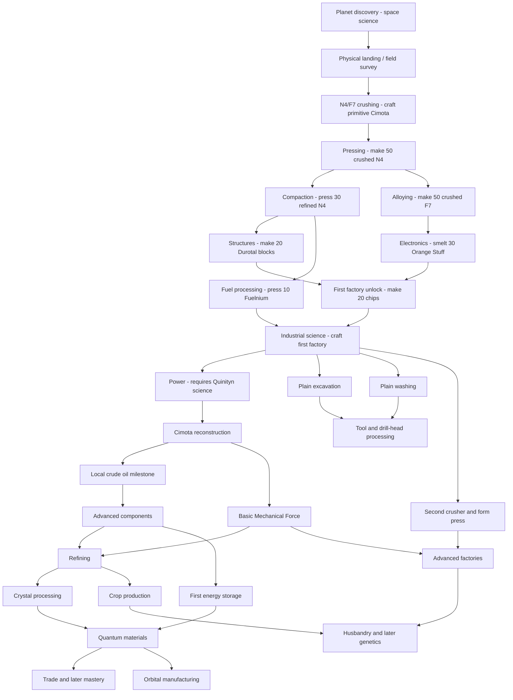

# Quinityn progression

The same progression is available inside Factorio through **59 Tips and Tricks chapters**, which appear at the relevant research milestones. Recipe and item links in those chapters open the game's own information views.

## Arrive, then establish industry

Discovery is researched through the normal Space Age route. The connection runs from Nauvis to Quinityn. Discovery or remote viewing alone does not unlock Yuoki; a character must physically arrive. The unlock belongs to the force, so teammates share it. The initial spawn remains unchanged.

If a character changes to an undiscovered force while already on Quinityn, finishing discovery completes that force's survey without another landing. The same physical-character checks apply; remote viewing and characterless controllers do not count.

The world is an industrial wasteland: dark ash, cracked slag, buried machinery, scattered industrial salvage, purple unicomp seas and smog. New-map terrain settings include **Unicomp liquid** (coverage and scale), **Quinityn cliffs** (enabled by default), independent **Quinityn enemy bases** and **Quinityn dead trees** (frequency, coverage and disable). The dry landing core remains protected from liquid and cliffs. Sparse purple dead and decaying trees provide wood outside the landing core. Surface pollution absorption is extremely low. Your machines' existing pollution emissions therefore matter to the biter population. Pollution is not artificially multiplied on other worlds.

The starting plateau provides **125,000–150,000 N4 and 125,000–150,000 F7**, in larger irregular patches whose positions, outline and richness vary by map seed. There are no natural iron, copper, coal, stone or crude-oil deposits. Large native starting ore patches are suppressed inside a 200-tile radius; modest distant N4/F7 deposits remain. The intended long-term resource source is unicomp conversion, not mining larger starter fields.

1. Mine N4/F7 or salvage. For salvage, select **Sort industrial salvage** (the scrap icon) in the Yuoki crafting tab; one scrap yields 2 N4, 2 F7, 2 stone and 1 wood. Hand-sort enough stone, carbon, iron ore, copper ore and emergency timber to build a furnace and early equipment. These emergency recipes are **hand-crafting only**.
2. Smelt plates. A fresh force can trigger vanilla Steam power and Electronics by crafting plates, then build its first lab and make red science.
3. Make the burner separator from 10 iron plates, 5 copper plates and 10 stone. Pump the purple ocean into it and fuel it with raw F7 chunks (1 MJ each), wood or coal. It produces water without electricity.
4. Crafting the primitive Cimota completes N4 and F7 crushing and unlocks the first crusher, wet crushing recipes and basic mining drill. Feed separated water to a boiler and steam engine; build poles, labs and assemblers. Produce 50 crushed N4 to unlock pressing and the heat form press, then follow the crafting milestones below to establish refined materials, Durotal structures and basic electronics.
5. Complete Fuelnium reactor fuel and First Yuoki factory research before crafting the factory for the science milestone. Reactor-fuel manufacture awards Technic Signs. Research vanilla Circuit network for its arithmetic combinator; `ye_fassembly1` unlocks at First Yuoki factory, after making 20 basic chips. Crafting the factory after both prerequisite branches completes Quinityn industrial science and unlocks the science and dedicated sign recipes. A Durotal block, compressed F7 and a sign produce five Quinityn research data packs in a Yuoki factory on Quinityn. Only `ye_fassembly1`, `ye_fassembly2` and `ye_fassembly_sp` accept the new science category.
6. Use the local science packs to research Yuoki power and then Cimota reconstruction. Solidify ocean unicomp in a Cimota and use the **existing Yuoki recipes** for ordinary resources. This replaces manual ore dressing for sustained production.

The nine bootstrap technologies use native crafting triggers after their prerequisites are complete:

| Milestone | Prerequisites within Quinityn | Crafting trigger | Main unlocks |
| --- | --- | --- | --- |
| N4 and F7 crushing | Field survey | 1 primitive Cimota Restructor | First crusher, wet N4/F7 crushing, basic mining drill |
| N4 and F7 pressing | N4 and F7 crushing | 50 crushed N4 | Heat form press and refined N4/F7 |
| Durotal and Fuelnium compaction | N4 and F7 pressing | 30 refined N4 | Durotal blocks and Fuelnium |
| Rich dust and Orange Stuff | N4 and F7 pressing | 50 crushed F7 | Rich dust mixing and Orange Stuff smelting |
| Durotal structures and reinforced gears | Durotal and Fuelnium compaction | 20 Durotal blocks | Structural elements, pressure-proof elements and reinforced gears |
| Conductive wire and basic chips | Rich dust and Orange Stuff | 30 Orange Stuff | Conductive wire, chip plates and basic chips |
| Fuelnium reactor fuel | Durotal and Fuelnium compaction | 10 Fuelnium | Reactor fuel with Technic Sign byproducts |
| First Yuoki factory | Durotal structures and reinforced gears, Conductive wire and basic chips | 20 basic chips | First-tier MF components and first factory |
| Quinityn industrial science | First Yuoki factory, Fuelnium reactor fuel | 1 first Yuoki factory | Industrial research data and dedicated Technic Sign qualification |

A constructive budget reserves 600 red packs, 400 green packs, 160 Quinityn data packs, two labs, the first Yuoki factory, a Cimota and 500 coal. The current material totals are recorded in [validation](validation.md), before incidental salvage or remote deposits. This is a finite-material check, not a speedrun or an assertion that no additional defenses will ever be needed.

The new dedicated **Qualify a Technic Sign** recipe produces only one sign from 12 reinforced gears, 8 Durotal structures, 20 conductive wire and 4 basic Yuoki chips, with 30 seconds of recipe work. It unlocks with Quinityn industrial science and uses the same three factories on Quinityn. Reactor-fuel byproduct signs remain available and cheaper for the initial bootstrap.

The terrain uses warped coastlines and narrow connecting land corridors. There is no forced origin pond; find a natural shore for your first pump. Salvage forms dense clusters in sparse industrial districts, with two nearby starter clusters. Ash, rubble, cracked slag, buried machinery and five decorative types break up the basalt. Unicomp blocks walking biters and spitters like ordinary water.

## Technology map

The survey is a descendant of **Planet discovery Quinityn**, not an available starter technology. Discovery costs the normal space-age sciences and unlocks travel; only physical landing completes the survey. The nine crafting milestones above consume no research packs. Materials is the first crushing milestone; factories and science have their own later unlocks. **Every pack-based Quinityn technology uses red, green and Quinityn packs** (infinite research also uses the standard advanced packs). Prerequisite bridges and the local crude-oil milestone retain their specific technology requirements.

The broad base disciplines now cover their first usable production stage. Upgrades have separate research:

| Research | Prerequisites within Quinityn | Packs of each required science |
| --- | --- | --- |
| Deep excavation | Quinityn industrial science | 50 |
| Ore washing and residue recovery | Quinityn industrial science | 40 |
| Tool-assisted processing | Deep excavation, Ore washing and residue recovery | 80 |
| Advanced crushing and forming | Quinityn industrial science | 80 |
| Advanced industrial components | Reconstructed petrochemistry | 100 |
| Maintenance workshops | Tool-assisted processing, Advanced crushing and forming, Advanced industrial components, Yuoki logistics | 100 |
| Industrial energy storage | Yuoki power and infrastructure, Ore washing and residue recovery, Advanced industrial components | 100 |
| Crystal accumulator upgrades | Industrial energy storage, Quantrinum and advanced electronics | 160 |
| Mixed-oxide reactor engineering | Yuoki industrial refining, Advanced industrial components, Contract world defense, Advanced electric generation | 160 |
| Quantum power systems | Crystal accumulator upgrades, Mixed-oxide reactor engineering | 250 |
| Industrial fluid handling | Mechanical force engineering | 80 |
| Advanced Yuoki factories | Mechanical force engineering, Advanced crushing and forming | 140 |
| Advanced Mechanical Force engines | Advanced Yuoki factories, Advanced industrial components | 180 |
| Advanced transport tubes | Mechanical force engineering, Advanced industrial components | 120 |
| Crystal and emulsion processing | Yuoki industrial refining, Ore washing and residue recovery | 150 |
| Animal husbandry and aquaculture | Yuoki agronomy and biology, Advanced Yuoki factories, Industrial fluid handling | 160 |
| First-generation industrial biology | Animal husbandry and aquaculture | 200 |
| Second-generation industrial biology | First-generation industrial biology, Quantrinum and advanced electronics | 250 |
| Third-generation industrial biology | Second-generation industrial biology | 300 |
| Advanced industrial inserters | Yuoki logistics, Quantrinum and advanced electronics | 160 |
| Yuoki robot networks | Yuoki logistics, Quantrinum and advanced electronics, Industrial energy storage | 180 |
| Advanced Yuoki robots | Yuoki robot networks | 240 |
| Advanced industrial defenses | Contract world defense, Advanced industrial components, Industrial energy storage | 160 |
| Yuoki powered armor | Laika trade network, Advanced industrial defenses, Industrial energy storage | 200 |
| Yuoki powered armor II | Yuoki powered armor, Crystal accumulator upgrades | 240 |
| Yuoki powered armor III | Yuoki powered armor II | 300 |
| Yuoki walker | Yuoki powered armor III, Mastercrafted industry | 400 |
| Advanced Yuoki walker | Yuoki walker | 500 |
| Industrial modules | Advanced industrial components | 100 |
| Advanced industrial modules | Industrial modules, Quantrinum and advanced electronics | 180 |
| Quantum module engineering | Advanced industrial modules | 250 |
| Industrial packaging | Yuoki agronomy and biology, Industrial fluid handling | 120 |
| Advanced electric generation | Yuoki power and infrastructure, Advanced industrial components, Mechanical force engineering, Yuoki industrial refining | 140 |
| Industrial fluid and electric infrastructure | Yuoki power and infrastructure, Advanced industrial components | 80 |

The tree separates **upgrades** while keeping related processing steps and same-tier variants together. For example, empty/charged battery cells are steps of one battery process; long, directional and underground transport variants are not successive machine tiers. Some optional products still need inputs from other industrial branches. Existing non-Yuoki research requirements on upstream unlocks are retained through automatic prerequisite bridges. The engine-generated [recipe manifest](recipe-unlocks.json) records every assigned unlock for review.

## Water and disposal

The ocean is the actual `y-liquid-uc2` fluid. The primitive Cimota converts 1 fluid into 100 water with a 2-second recipe at 0.5 crafting speed: 100 water every 4 seconds, at 180 kW of burner power. It uses the Cimota building and icon, with the previous separator identifier retained for save compatibility. Water and unicomp networks must remain separate. Later machinery can scale or replace bootstrap infrastructure using the existing mod recipes.

Items dropped into unicomp are destroyed by the same native tile capability used by lava. A shore inserter can dispose of surplus. This gives no resource refund and does not reduce the sea. Filter disposal to protect science, fuel and seed reserves. Item quality does not prevent disposal.

## Foundations and expansion

Only **Durotal foundations** cover unicomp seas. Ordinary landfill, normal foundation and other built-in paving do not. The starting plateau supports the bootstrap until this research becomes available after industrial refining.

In a Yuoki form press **on Quinityn**:

- 2 Durotal structure elements
- 1 pressure-proof element
- 5 Orange Stuff
- 10 stone bricks
- Result: **4 Durotal foundations**, in 8 seconds

This is a separate item and tile. Its placement destinations inherit the normal foundation list, plus unicomp, so it can be exported anywhere normal foundations work. Its frozen variant thaws back to the Durotal version, and mining returns the corresponding item. It does not change the vanilla foundation recipe or unlock Aquilo's other technology.

## Local oil and rockets

A local production run that conservatively withholds prior Oil processing would otherwise be stuck at Oil processing because that vanilla technology asks for crude-oil mining. Quinityn has no oil deposit. The alternate local technology instead requires crafting 80 crude oil after Cimota and Oil gathering; completing it grants the normal Oil processing technology.

Follow the vanilla chemistry and rocket prerequisites with locally reconstructed resources. Steel, plastic, sulfuric acid, engines, circuits, concrete, low density structures, processing units and rocket fuel all have local production paths. Trade and incoming platform supplies are **not required** for the rocket-material dependency proof.

Orbital manufacturing later offers local variants using Durotal structures and Yuoki chips. You can launch before completing every optional Yuoki discipline by using the vanilla component recipes. Launching and interplanetary travel still use normal Space Age platform rules; this addon does not conjure a rescue platform.

## Persistent endgame use

Quinityn research data can only be manufactured on Quinityn. Export it to a central research world, or import the other sciences and run labs locally.

Two technologies repeat indefinitely:

- **Quinityn extraction productivity:** +10 percentage points of mining productivity each level.
- **Yuoki plasma amplification:** +10 percentage points of plasma ammunition damage each level.

Each level costs `1000 × 1.5^(level − 1)` units. Each unit takes 60 seconds at base research speed and consumes two Quinityn packs plus one each of red, green, blue, purple, yellow and space science. Neither benefit runs into a recipe-productivity cap. Continuous planet science production remains useful after all finite technology is complete.

## Existing saves and compatibility

New and existing forces are reconciled on configuration changes. Already researched Quinityn unlocks are retained. Unrelated recipe flags are preserved. A force already physically on the planet receives its survey; a new or unvisited force remains gated. Native force-merge research behavior is followed.

This development revision of 0.1.0 changes newly generated chunks. Already explored terrain and existing ore amounts are preserved; generate a new map to evaluate the revised starter layout. Placed separators retain their IDs and become primitive Cimotas. Move science production into a Yuoki factory.

Adding the mod does not erase previously built Yuoki machines, items or ore patches from an existing save. Existing stock and queued machine crafting are not confiscated. For the intended discovery balance, use a save that has not already established Yuoki industry. The upstream optional starting suit is forced off because it bypasses the visit gate.

The supported baseline is the required Yuoki/Engines/Space Age set. Other overhaul mods, separate Yuoki tech-tree mods, alternative-start mods and later dependency revisions need separate compatibility testing.

### Updating an existing development save

Completed technologies stay completed. Recipes moved into the new upgrade technologies require those new technologies to be researched; this deliberately replaces the old bulk unlocks. Existing buildings and items remain. Discovery and arrival are required for a new force; debug teleporting an undiscovered force is not a supported starting-planet mode.
