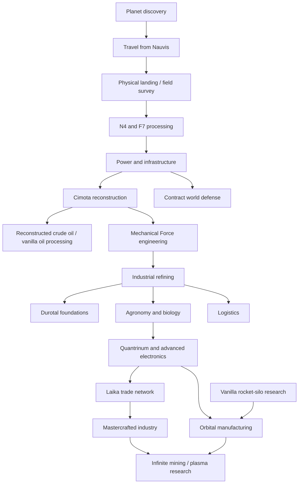

# Quinityn progression

The same progression is available inside Factorio through **17 Tips and Tricks chapters**, which appear at the relevant research milestones. Recipe and item links in those chapters open the game's own information views.

## Arrive, then establish industry

Discovery is researched through the normal Space Age route. The connection runs from Nauvis to Quinityn. Discovery or remote viewing alone does not unlock Yuoki; a character must physically arrive. The unlock belongs to the force, so teammates share it. The initial spawn remains unchanged.

The world is an industrial wasteland: dark ash, cracked slag, buried machinery, scattered industrial salvage, purple unicomp seas and smog. New-map terrain settings include **Unicomp liquid** (coverage and scale), **Quinityn cliffs** (enabled by default) and independent **Quinityn enemy bases**. The dry landing core remains protected from liquid and cliffs. There are no natural trees. Surface pollution absorption is extremely low. Your machines' existing pollution emissions therefore matter to the biter population. Pollution is not artificially multiplied on other worlds.

The starting plateau provides **125,000–150,000 N4 and 125,000–150,000 F7**, in larger irregular patches whose positions, outline and richness vary by map seed. There are no natural iron, copper, coal, stone or crude-oil deposits. Large native starting ore patches are suppressed inside a 200-tile radius; modest distant N4/F7 deposits remain. The intended long-term resource source is unicomp conversion, not mining larger starter fields.

1. Mine N4/F7 or salvage. For salvage, select **Sort industrial salvage** (the scrap icon) in the Yuoki crafting tab; one scrap yields 2 N4, 2 F7, 2 stone and 1 wood. Hand-sort enough stone, carbon, iron ore, copper ore and emergency timber to build a furnace and early equipment. These emergency recipes are **hand-crafting only**.
2. Smelt plates. A fresh force can trigger vanilla Steam power and Electronics by crafting plates, then build its first lab and make red science.
3. Make the burner separator from 10 iron plates, 5 copper plates and 10 stone. Pump the purple ocean into it and fuel it with raw F7 chunks (1 MJ each), wood or coal. It produces water without electricity.
4. Feed that water to a boiler and steam engine. Build poles, labs, assemblers, a Yuoki crusher and a heat form press.
5. Develop the native N4/F7 lines. Making reactor fuel awards Technic Signs. A Durotal block, compressed F7 and a sign produce five Quinityn research data packs in a Yuoki factory on Quinityn. Research vanilla Circuit network for the arithmetic combinator needed by the first factory; its recipe now unlocks with Materials. Only `ye_fassembly1`, `ye_fassembly2` and `ye_fassembly_sp` accept the new science category.
6. Research Cimota reconstruction. Solidify ocean unicomp in a Cimota and use the **existing Yuoki recipes** for ordinary resources. This replaces manual ore dressing for sustained production.

A constructive budget reserves 600 red packs, 400 green packs, 100 Quinityn data packs, two labs, the first Yuoki factory, a Cimota and 500 coal. The current material totals are recorded in [validation](validation.md), before incidental salvage or remote deposits. This is a finite-material check, not a speedrun or an assertion that no additional defenses will ever be needed.

The new dedicated **Qualify a Technic Sign** recipe produces only one sign from 12 reinforced gears, 8 Durotal structures, 20 conductive wire and 4 basic Yuoki chips, with 30 seconds of recipe work. It unlocks with Materials and uses the same three factories on Quinityn. Reactor-fuel byproduct signs remain available and cheaper for the initial bootstrap.

The terrain uses warped coastlines and narrow connecting land corridors. There is no forced origin pond; find a natural shore for your first pump. Salvage forms dense clusters in sparse industrial districts, with two nearby starter clusters. Ash, rubble, cracked slag, buried machinery and five decorative types break up the basalt. Unicomp blocks walking biters and spitters like ordinary water.

## Technology map

| Discipline | What it teaches | Science / count |
| --- | --- | --- |
| Field survey | Manual recovery, separator and water | Physical landing |
| Materials | Crushers, presses, N4/F7 refining, parts and local science | Red / 30 |
| Power | Fuel, generators, accumulators, fluid infrastructure | Red + green / 60 |
| Cimota | UC conversion and reconstruction | Red + green + Quinityn / 100 |
| Engines | MF, motors, transmission and specialized machinery | Red + green + Quinityn / 120 |
| Refining | Fluids, catalysts, byproducts and industrial smelting | Red + green + Quinityn / 150 |
| Agriculture | Crops, biological products, DNA, animals and fish | Red + green + Quinityn / 180 |
| Logistics | Yuoki inserters, storage and robots | Red + green + Quinityn / 180 |
| Defense | Yuoki ammunition, walls, turrets and equipment | Red + green / 100 |
| Quantum | Quantrinum, advanced electronics and related machinery | Red + green + Quinityn / 250 |
| Trade | Merchant Signs, reputation, Laika and exports | Red + green + Quinityn / 300 |
| Mastery | Mastercrafted and ultimate products | Red + green + Quinityn / 500 |
| Foundations | Expansion across unicomp and exportable terrain support | Red + green + Quinityn / 200 |
| Orbital | Yuoki alternative rocket-component recipes | Red + green + Quinityn / 200, plus rocket-silo prerequisite |

The tree unlocks **design families**. Some expensive machines within a family need ingredients developed later. The guide calls this out rather than suggesting that research alone supplies those ingredients. Existing non-Yuoki research requirements on upstream unlocks are retained through automatic prerequisite bridges. The engine-generated [recipe manifest](recipe-unlocks.json) records every assigned unlock for review.

## Water and disposal

The ocean is the actual `y-liquid-uc2` fluid. The primitive Cimota converts 1 fluid into 100 water with a 2-second recipe at 0.5 crafting speed: 100 water every 4 seconds, at 180 kW of burner power. It uses the Cimota building and icon, with the previous separator identifier retained for save compatibility. Water and unicomp networks must remain separate. Later machinery can scale or replace bootstrap infrastructure using the existing mod recipes.

Items dropped into unicomp are destroyed by the same native tile capability used by lava. A shore inserter can dispose of surplus. This gives no resource refund and does not reduce the sea. Filter disposal to protect science, fuel and seed reserves. Item quality does not prevent disposal.

## Foundations and expansion

Only **Durotal foundations** cover unicomp seas. Ordinary landfill, normal foundation and other built-in paving do not. The starting plateau supports the bootstrap until this research becomes available after industrial refining.

In a Yuoki form press **on Quinityn**:

- 2 Durotal structure elements
- 1 pressure-proof element
- 5 Orange Stuff
- 10 stone bricks
- Result: **4 Durotal foundations**, in 8 seconds

This is a separate item and tile. Its placement destinations inherit the normal foundation list, plus unicomp, so it can be exported anywhere normal foundations work. Its frozen variant thaws back to the Durotal version, and mining returns the corresponding item. It does not change the vanilla foundation recipe or unlock Aquilo's other technology.

## Local oil and rockets

A true zero-research force would normally be stuck at Oil processing because that vanilla technology asks for crude-oil mining. Quinityn has no oil deposit. The alternate local technology instead requires crafting 80 crude oil after Cimota and Oil gathering; completing it grants the normal Oil processing technology.

Follow the vanilla chemistry and rocket prerequisites with locally reconstructed resources. Steel, plastic, sulfuric acid, engines, circuits, concrete, low density structures, processing units and rocket fuel all have local production paths. Trade and incoming platform supplies are **not required** for the rocket-material dependency proof.

Orbital manufacturing later offers local variants using Durotal structures and Yuoki chips. You can launch before completing every optional Yuoki discipline by using the vanilla component recipes. Launching and interplanetary travel still use normal Space Age platform rules; this addon does not conjure a rescue platform.

## Persistent endgame use

Quinityn research data can only be manufactured on Quinityn. Export it to a central research world, or import the other sciences and run labs locally.

Two technologies repeat indefinitely:

- **Quinityn extraction productivity:** +10 percentage points of mining productivity each level.
- **Yuoki plasma amplification:** +10 percentage points of plasma ammunition damage each level.

Each level costs `1000 × 1.5^(level − 1)` units. Each unit takes 60 seconds at base research speed and consumes two Quinityn packs plus one each of red, green, blue, purple, yellow and space science. Neither benefit runs into a recipe-productivity cap. Continuous planet science production remains useful after all finite technology is complete.

## Existing saves and compatibility

New and existing forces are reconciled on configuration changes. Already researched Quinityn unlocks are retained. Unrelated recipe flags are preserved. A force already physically on the planet receives its survey; a new or unvisited force remains gated. Native force-merge research behavior is followed.

This development revision of 0.1.0 changes newly generated chunks. Already explored terrain and existing ore amounts are preserved; generate a new map to evaluate the revised starter layout. Placed separators retain their IDs and become primitive Cimotas. Move science production into a Yuoki factory.

Adding the mod does not erase previously built Yuoki machines, items or ore patches from an existing save. Existing stock and queued machine crafting are not confiscated. For the intended discovery balance, use a save that has not already established Yuoki industry. The upstream optional starting suit is forced off because it bypasses the visit gate.

The supported baseline is the required Yuoki/Engines/Space Age set. Other overhaul mods, separate Yuoki tech-tree mods, alternative-start mods and later dependency revisions need separate compatibility testing.
